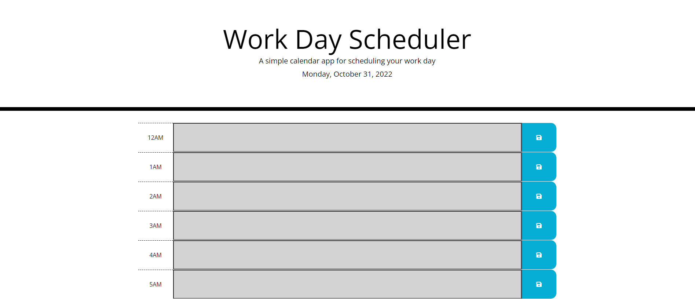
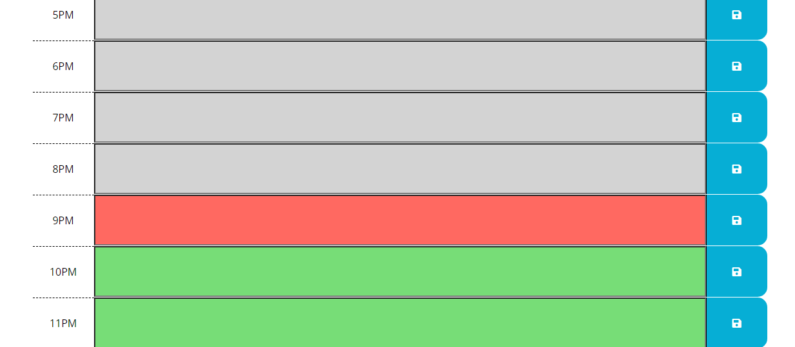
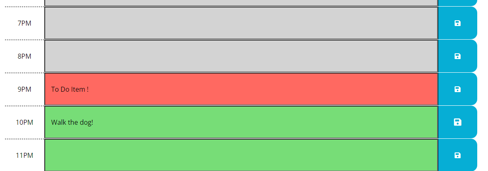
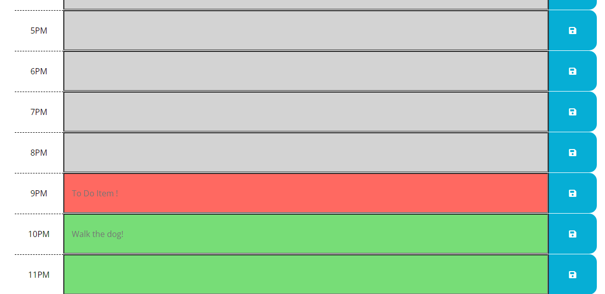

# Bootcamp-Work-Day-Scheduler

Hello! In this project we took advantage of using an API to handle date and times within JavaScript.
Please check out the site [here!](https://isaacagonzalez.github.io/Bootcamp-Work-Day-Scheduler/)

The page uses the Luxon API instead of Moment to get the current time and from there past hours in the day are grayed out, current hour in red, and future hours in green. Today's date is also shown at the top of the page under the title.

Each hour row is also an HTML input element so that user's can add tasks to a specific hour

The user inputs are saved to local storage when the blue save button is pushed so that when the page is refreshed the tasks still remaining at the assigned hour.

